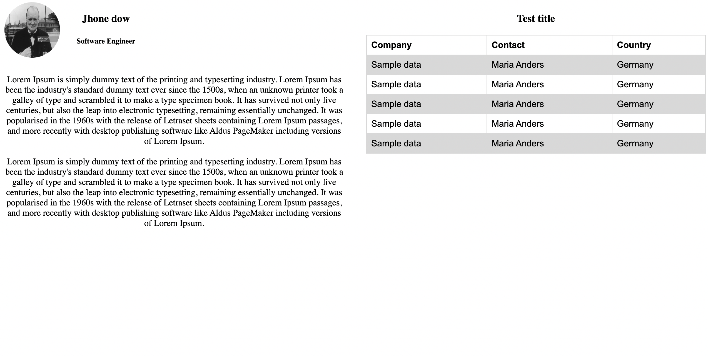
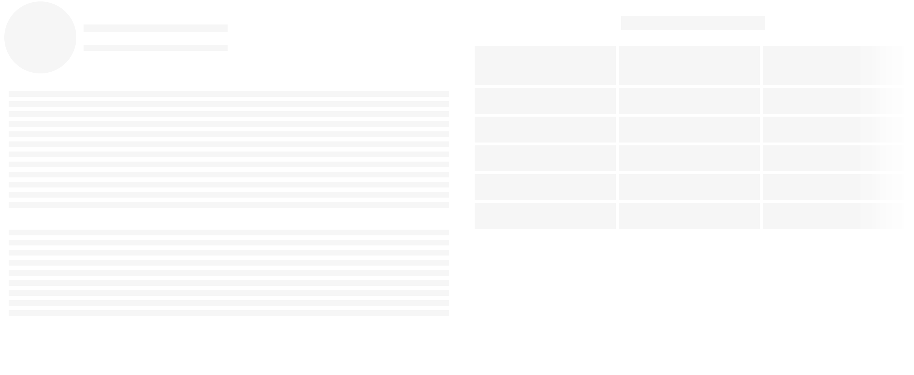

## Skeleton


### Usage


- There will be two main component in this skeleton layout
 one is `<Section />` this is the main layout
 this has three props

- and other one is diffrent Shapes
 `<Paragraph> `
 `<Round>`
 `<Square>`
 `<Table>`


#### `<Section />`
- you can create multiple secion in same page

##### Props
  contentReady: boolean; show skelteon or show content based on this prop
  skeleton: React.ReactNode; skeleton structure, you can create your own structure, by using shapes  `<Paragraph> , <Round>, <Square> ,<Table>`
  children: React.ReactNode; the actual content

##### Example

```jsx

      <Section
        contentReady={contentReady}
        skeleton={
          <>
            <Row align="center">
              <Round size={100} />
              <div>
                <Square mx={10} width={200} height={10} />
                <br />
                <Square mx={10} width={200} height={8} />
              </div>
            </Row>
            <br />
            <Paragraph rowCount={12} />
            <br />
            <Paragraph rowCount={9} />
          </>
        }
      >
        <div>
          <div
            style={{
              display: "flex",
              flexDirection: "row",
              alignItems: "center",
              marginBottom: 30,
            }}
          >
```


### shapes supported
can use mutli level shapes inside any shape component
#### `<Paragraph />`

##### Props
  - width?: string | number
  - lineHeight?: number
  - background?: string
  - center?: boolean
  - style?: any
  - rowCount?: number

  #### `<Round />`

  ##### Props
  - size?: number;
  - children?: React.ReactNode;
  - center?: boolean;
  - my?: number;
  - mx?: number;
  - style?: any;
  #### `<Square />`

  ##### Props
  - rounded?: boolean;
  - width?: string | number;
  - height?: number;
  - background?: string;
  - center?: boolean;
  - style?: any;
  - children?: React.ReactNode;
  - repeat?: number;
  - mx?: number;
  - my?: number;

  #### `<Table />`

  ##### Props
  - width?: string | number;
  - height?: number;
  - background?: string;
  - center?: boolean;
  - style?: any;
  - children?: React.ReactNode;
  - repeat?: number;
  - columnCount?: number;
  - rowCount?: number;
  - header?: boolean | true;


  #### styling
  - there some defualt props like width, height, my , mx, center to align styling
  - also can pass style params to all components for custom styling